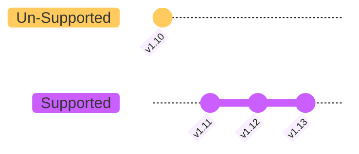

---
{"dg-publish":true,"permalink":"/garden-notes/cluster-upgrades/","tags":["note","seedling"],"created":"2023-06-06","updated":"2024-11-29T14:43"}
---

# Cluster Upgrades

- Kubernetes versioning convention is `v<major>.<minor>.<patch>`, e.g. `v1.25.1`. 
- Minor versions are released every three months, whereas patch versions are released every week.
- Kubernetes provides support for 3 recent minor versions.
- Core controlplane components never should be at higher version than `kube-apiserver`, but can be at lower version:
	- `kube-apiserver`: X
	- `controller-manager`: X-1
	- `kube-scheduler`: X-1
	- `kublet`: X-2
	- `kube-proxy`: X-2
	- `kubectl`: X+1 >X-1

## When to Upgrade?

Upgrade should be planned before current cluster version gots expired. Kubernetes provides support for 3 recent minor versions, e.g. once version `v1.13` is being released, the `v1.10` becomes unsupported. The recommended way of upgrading a cluster is one version at time. If you want upgrade from `v1.10` to `v1.13`, you should upgrade first to `v1.11`, then `v1.12` and finally `1.13`


## Upgrade Strategy

Each cluster upgrade starts from upgrading `controlplane`. When `controlplane` is down during the upgrade all pods hosted on worker nodes are not impacted. 

There are 3 strategies for upgrading worker nodes:
- Strategy 1 - All at once. All worker nodes are upgraded at the same time, the incur downtime for all hosted pods.
- Strategy 2 - One by one. One worker nod is upgraded at time. Pods are evicted to other nodes for upgrade time that allows avoid downtime.
- Strategy 3 - Add new nodes. New nodes with already upgraded version are added to the cluster. Then old nodes are drained from pods and removed.

## Upgrade Procedure

1. List the lates available version with `kubeadm upgrade plan`:
   
```shell
root@controlplane $ kubeadm upgrade plan
[upgrade/config] Making sure the configuration is correct:
[upgrade/config] Reading configuration from the cluster...
[upgrade/config] FYI: You can look at this config file with 'kubectl -n kube-system get cm kubeadm-config -o yaml'
[preflight] Running pre-flight checks.
[upgrade] Running cluster health checks
[upgrade] Fetching available versions to upgrade to
[upgrade/versions] Cluster version: v1.26.0
[upgrade/versions] kubeadm version: v1.26.0
I0615 08:15:00.653385   18529 version.go:256] remote version is much newer: v1.27.3; falling back to: stable-1.26
[upgrade/versions] Target version: v1.26.6
[upgrade/versions] Latest version in the v1.26 series: v1.26.6

Components that must be upgraded manually after you have upgraded the control plane with 'kubeadm upgrade apply':
COMPONENT   CURRENT       TARGET
kubelet     2 x v1.26.0   v1.26.6

Upgrade to the latest version in the v1.26 series:

COMPONENT                 CURRENT   TARGET
kube-apiserver            v1.26.0   v1.26.6
kube-controller-manager   v1.26.0   v1.26.6
kube-scheduler            v1.26.0   v1.26.6
kube-proxy                v1.26.0   v1.26.6
CoreDNS                   v1.9.3    v1.9.3
etcd                      3.5.6-0   3.5.6-0

You can now apply the upgrade by executing the following command:

        kubeadm upgrade apply v1.26.6

Note: Before you can perform this upgrade, you have to update kubeadm to v1.26.6.

_____________________________________________________________________


The table below shows the current state of component configs as understood by this version of kubeadm.
Configs that have a "yes" mark in the "MANUAL UPGRADE REQUIRED" column require manual config upgrade or
resetting to kubeadm defaults before a successful upgrade can be performed. The version to manually
upgrade to is denoted in the "PREFERRED VERSION" column.

API GROUP                 CURRENT VERSION   PREFERRED VERSION   MANUAL UPGRADE REQUIRED
kubeproxy.config.k8s.io   v1alpha1          v1alpha1            no
kubelet.config.k8s.io     v1beta1           v1beta1             no
_____________________________________________________________________
```

2. Start from upgrading `controlplane` node. If the cluster was deployed with `kubeadm` tool, upgrade it at first place:
   
```
root@controlplane $ apt-get update && apt-get install -y kubeadm=1.27.0-00
```

3. If the `controlplane` node is hosting pods, drain it to evict all running pods and mark the node as `UnSchedulable`:
   
```
root@controlplane $ kubectl drain controlplane --ignore-daemonsets
node/controlplane already cordoned
Warning: ignoring DaemonSet-managed Pods: kube-flannel/kube-flannel-ds-dgwmh, kube-system/kube-proxy-27lvt
evicting pod kube-system/coredns-787d4945fb-jwpkr
evicting pod default/blue-987f68cb5-2qxb2
evicting pod kube-system/coredns-787d4945fb-hxx4f
evicting pod default/blue-987f68cb5-66qt2
pod/blue-987f68cb5-2qxb2 evicted
pod/blue-987f68cb5-66qt2 evicted
pod/coredns-787d4945fb-hxx4f evicted
pod/coredns-787d4945fb-jwpkr evicted
node/controlplane drained
```

4. Upgrade the `controlplane` node:

```
root@controlplane $ kubeadm upgrade apply v1.27.0
```

5. Upgrade `kubelet` and `kubectl` on `controlplane` node:

```
root@controlplane $ apt-get update && apt-get install -y kubelet=1.27.0-00 kubectl=1.27.0-00
root@controlplane $ systemctl daemon-reload
root@controlplane $ systemctl restart kubelet
```

6. Mark the `controlplane` node back to `Schedulable`:

```
root@controlplane $ kubectl uncordon controlplane
```

7. Drain first `worker` node:

```
root@controlplane $ kubectl drain node01 --ignore-daemonsets
```

8. Upgrade `kubeadm` on `worker` node:

```
root@node01 $ apt-get update && apt-get install -y kubeadm=1.27.0-00
```

9. Upgrade `worker` node:

```
root@node01 $ kubeadm upgrade node
```

10. Upgrade `kubelet` and `kubectl` on `worker` node:

```
root@node01 $ apt-get update && apt-get install -y kubelet=1.27.0-00 kubectl=1.27.0-00
root@node01 $ systemctl daemon-reload
root@node01 $ systemctl restart kubelet
```

11. Mark the `worker` node back to `Schedulable`:

```
root@controlplane $ kubectl uncordon node01
```
---
- https://kubernetes.io/docs/tasks/administer-cluster/kubeadm/kubeadm-upgrade/
- https://kubernetes.io/docs/tasks/administer-cluster/kubeadm/upgrading-linux-nodes/