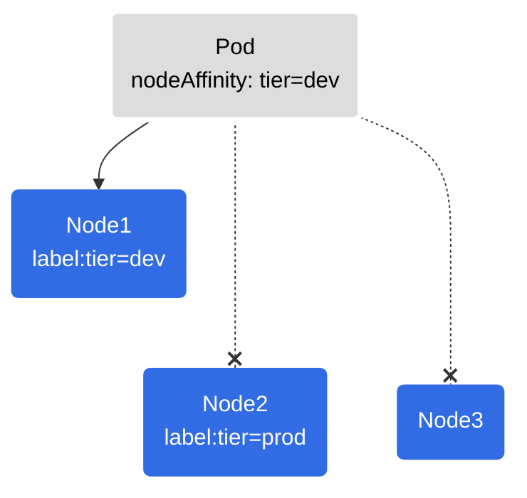
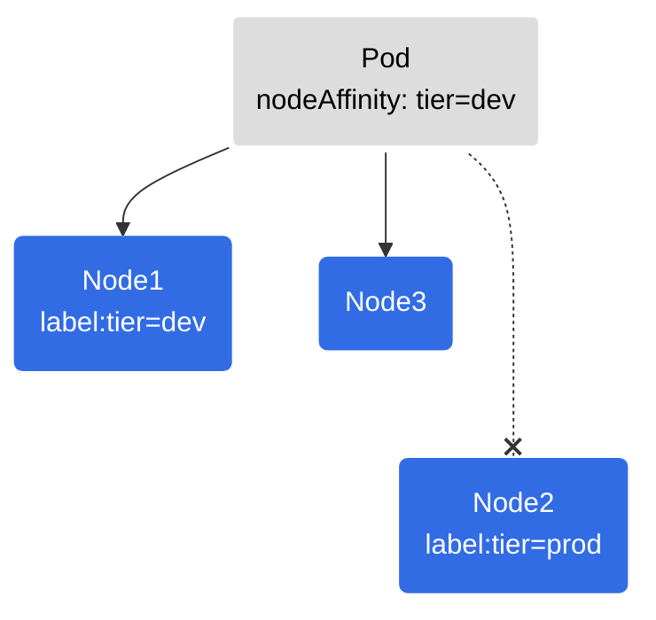

---
{"dg-publish":true,"permalink":"/garden-notes/node-affinity/","tags":["note","seedling"],"created":"2023-02-07","updated":"2024-11-29T14:51"}
---

# Node Affinity

Node affinity idea is similar to [[Garden Notes/Node Selector\|Node Selector]] but it enables a conditional approach with logical operators in the matching process.

## Node Affinity Types

- `requiredDuringSchedulingIgnoredDuringExecution` - Affects only **scheduled** pods and **requires** node affinity rule match, otherwise pod will not be run.
- `preferredDuringSchedulingIgnoredDuringExecution` - Affects only **scheduled** pods and **prefers** nodes that match affinity rule. If no match, pod will be run anyway.
- `requiredDuringSchedulingRequiredDuringExecution` (planned in future release) - Affects **scheduled** and **running** pods and **requires** node affinity rule match. If not match, pod will not be run or if it is already running will be evicted (terminated).


_Figure 1: Scheduling a pod with "requiredDuringSchedulingIgnoredDuringExecution" type. The pod will be scheduled only if there is a matching node._


_Figure 2: Scheduling a pod with "preferredDuringSchedulingIgnoredDuringExecution". The pod will be scheduled on matching node if available. Otherwise it will be scheduled on any applicable node._

## Adding Node Affinity to a Pod

```yaml
apiVersion: v1
kind: Pod
metadata:
  name: with-node-affinity
spec:
  affinity:
    nodeAffinity:
      requiredDuringSchedulingIgnoredDuringExecution:
        nodeSelectorTerms:
        - matchExpressions:
          - key: topology.kubernetes.io/zone
            operator: In
            values:
            - antarctica-east1
            - antarctica-west1
      preferredDuringSchedulingIgnoredDuringExecution:
      - weight: 1
        preference:
          matchExpressions:
          - key: another-node-label-key
            operator: In
            values:
            - another-node-label-value
  containers:
  - name: with-node-affinity
    image: registry.k8s.io/pause:2.0
```

---
- https://kubernetes.io/docs/concepts/scheduling-eviction/assign-pod-node/
- https://docs.openshift.com/container-platform/4.12/nodes/scheduling/nodes-scheduler-node-affinity.html
- https://blog.kubecost.com/blog/kubernetes-node-affinity/