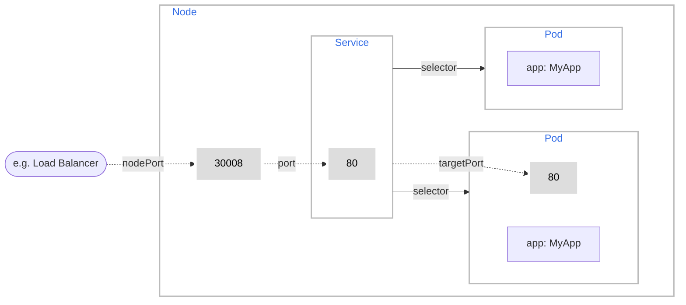

---
{"dg-publish":true,"permalink":"/garden-notes/services/","tags":["note","seedling"],"created":"2023-02-02T10:48:00","updated":"2024-11-29T14:52"}
---

# Services

Each Pod gets its own IP address, however in a Deployment, the set of Pods running in one moment in time could be different from the set of Pods running that application a moment later.

In Kubernetes, a Service is an abstraction which defines a logical set of Pods and a policy by which to access them (sometimes this pattern is called a micro-service). The set of Pods targeted by a Service is usually determined by a selector. 

## Example Service

```yaml
apiVersion: v1
kind: Service
metadata:
  name: my-service
spec:
  type: NodePort # If not specified, a default type is ClusterIP
  selector:
    app: MyApp
  ports:
    - protocol: TCP
      port: 80
      targetPort: 9376
      nodePort: 30001 # If not specified, Kubernetes control plane will allocate a port from a range (default: 30000-32767)
```

## Port Types

Service definition can specify three port types:

- `nodePort` - is a port that will be alllocated by service on each cluster node (default: 30000-32767)
- `port` - is a port that service exposes within a custer
- `targetPort` - is a port exposed by Pod


_Figure 1: Exposing a pod on a node's port. 

## Service Types

Kubernetes `ServiceTypes` allow you to specify what kind of Service you want.

`Type` values and their behaviors are:

-   `ClusterIP`: Exposes the Service on a cluster-internal IP. Choosing this value makes the Service only reachable from within the cluster. This is the default that is used if you don't explicitly specify a `type` for a Service. You can expose the service to the public with an [Ingress](https://kubernetes.io/docs/concepts/services-networking/ingress/) or the [Gateway API](https://gateway-api.sigs.k8s.io/).
-   [`NodePort`](https://kubernetes.io/docs/concepts/services-networking/service/#type-nodeport): Exposes the Service on each Node's IP at a static port (the `NodePort`). To make the node port available, Kubernetes sets up a cluster IP address, the same as if you had requested a Service of `type: ClusterIP`.
-   [`LoadBalancer`](https://kubernetes.io/docs/concepts/services-networking/service/#loadbalancer): Exposes the Service externally using a cloud provider's load balancer.
-   [`ExternalName`](https://kubernetes.io/docs/concepts/services-networking/service/#externalname): Maps the Service to the contents of the `externalName` field (e.g. `foo.bar.example.com`), by returning a `CNAME` record with its value. No proxying of any kind is set up.

---
- https://kubernetes.io/docs/concepts/services-networking/service/