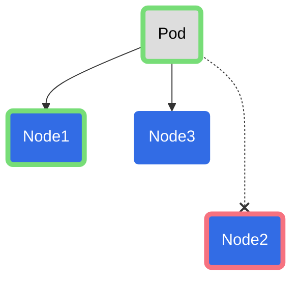

---
{"dg-publish":true,"permalink":"/garden-notes/taints-and-tolerations/","tags":["note","seedling"],"created":"2023-02-03T17:06:00","updated":"2024-11-29T14:52"}
---

# Taints and Tolerations

`Taints` allow a node to reject a set of pods. Taint can take three effects:

- `NoSchedule` - Kubernetes will not schedule the pod onto that node.
- `PreferNoSchedule` - Kubernetes will try to not schedule the pod onto the node.
- `NoExecute` - Kubernetes will not schedule the pod onto that node and if a pod is already running on a node it will be evicted (terminated).

`Tolerations` are applied to pods. Tolerations allow the scheduler to schedule pods with matching taints. Tolerations allow scheduling but **don't guarantee** scheduling (see _Figure 1_)


_Figure 1: Scheduling of a pod with taints an tolerations. Node1 has a taint `color=green:Noschedule`, Node2 has `color=red:Noschedule` and Node3 has no taint. Pod is configured with toleration accepting `color=green:NoSchedule`. Scheduler can place the pod on Node1 or Node3.

## Tainting a Node

Add taint:

```bash
kubectl taint nodes node1 key1=value1:NoSchedule
```

Remove taint:

```bash
kubectl taint nodes node1 key1=value1:NoSchedule-
```


## Adding Tolerations to a Pod

```yaml
apiVersion: v1
kind: Pod
metadata:
  name: nginx
  labels:
    env: test
spec:
  containers:
  - name: nginx
    image: nginx
    imagePullPolicy: IfNotPresent
  tolerations:
  - key: "key1"
	operator: "Equal"
	value: "value1"
	effect: "NoSchedule"
  - key: "key2"
    operator: "Exists"
    effect: "NoSchedule"
```


---
- https://kubernetes.io/docs/concepts/scheduling-eviction/taint-and-toleration/